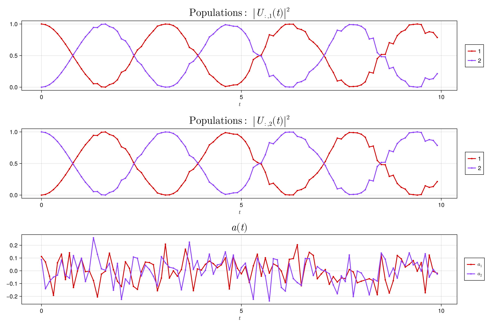

# PiccoloPlots

[](https://kestrelquantum.github.io/PiccoloPlots.jl/stable/)
[](https://kestrelquantum.github.io/PiccoloPlots.jl/dev/)
[](https://github.com/kestrelquantum/PiccoloPlots.jl/actions/workflows/CI.yml?query=branch%3Amain)
[](https://codecov.io/gh/kestrelquantum/PiccoloPlots.jl)

PiccoloPlots.jl is designed to hold plotting recipes for the Piccolo.jl package. It utilzes the `plot` method of the [`NamedTrajectories.jl`](https://github.com/kestrelquantum/NamedTrajectories.jl).

## Installation
PiccoloPlots.jl can be installed using the Julia package manager. From the Julia REPL, type `]` to enter the Pkg REPL mode and run:

```julia
julia> ] add PiccoloPlots
```

## Usage
As a simple example, we provide the `plot_unitary_populations` function which plots the populations of select columns of the unitary matrix. This can be employed as follows:

```julia
using NamedTrajectories
using PiccoloQuantumObjects
using PiccoloPlots

# Define the Hamiltonian H = X + a_1(t)Z + a_2(t)Y
H_drift = PAULIS[:X]
H_drives = [PAULIS[:Z], PAULIS[:Y]]

# Generate control trajectory 
N = 100

Δt = 0.1
ts = collect(0:Δt:Δt*(N-1))

a = 0.1 * randn(length(H_drives), length(ts))

# Generate the unitaries
Us = exp.(-im * [(H_drift + sum(a[:, k] .* H_drives)) * ts[k] for k = 1:N])

# Create a NamedTrajectory
traj = NamedTrajectory(
    (
        Ũ⃗ = hcat(operator_to_iso_vec.(Us)...),
        a = a
    );
    controls = :a,
    timestep = Δt
)

# Plot the populations of the first and second qubits
plot_unitary_populations(traj)
```


## Contributing
TODO: link to guidlines
Contributions are welcome! Please read our [guidelines]() for more information.

## License
PiccoloPlots.jl is licensed under the MIT License.
